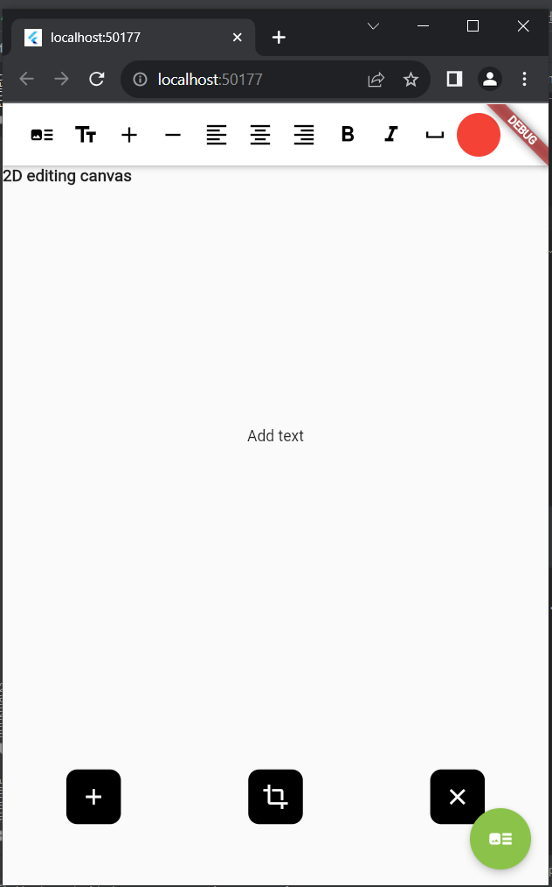
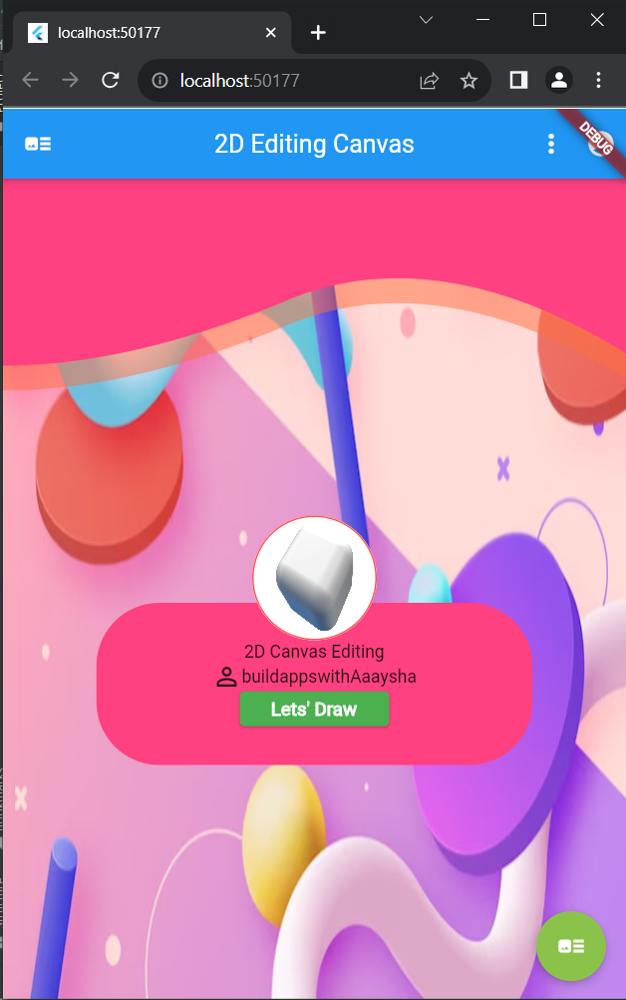
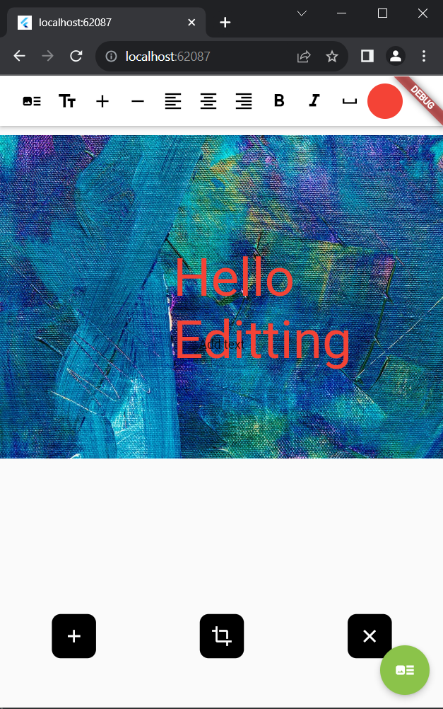
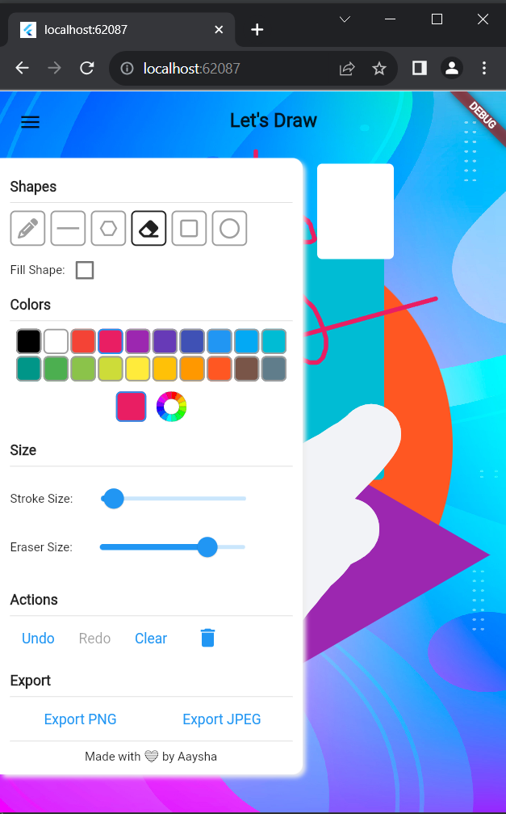

# appdevelopmentapplications_aaysha

Assignment for Internship Shortlisting:

Title: Flutter 2D Editing Canvas
## Getting Started

This project is a starting point for a Flutter application.
✨ Features

# Available Features
-  Scribble.
-  Draw Shapes (Line, Polygon, Ellipse and Rectangle).
-  Eraser.
-  shape fill and stroke size
-  Undo and Redo
-  Export as Image
-  Text Editing and Image cropping *HomeScreen.dart
-  contactus *home.dart
   Api Used

Additional features 
-multi image selection and editing 
- better design and important packages used.

#📸 ScreenShots

 Author(s)

**Aaysha Shaikh K**

